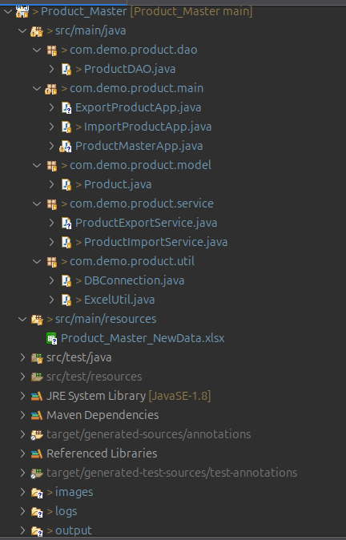
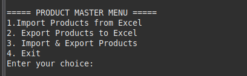
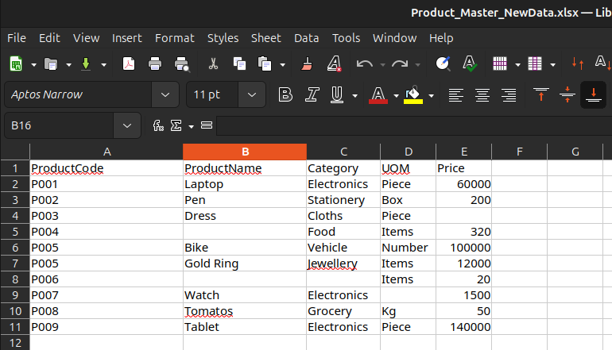
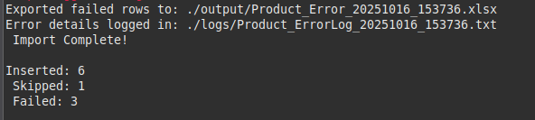
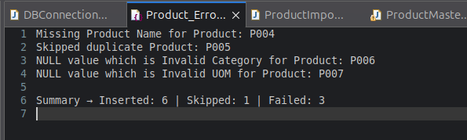
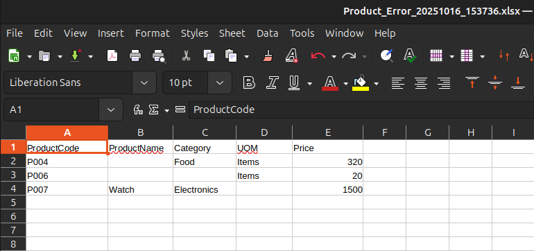
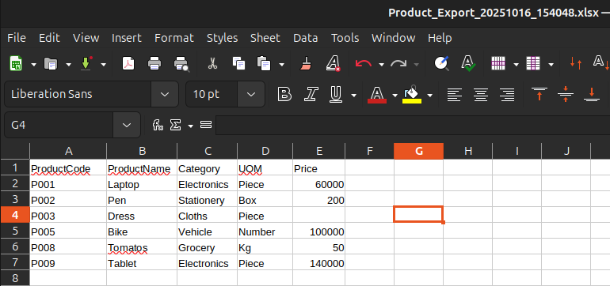

**Import - Export Module**

A Java-based **Product Management** utility that allows users to **import**, **validate**, and **export** product data between Excel files (.xlsx) and a **PostgreSQL** database.

This project demonstrates robust data handling, Excel processing using **Apache POI**, and error logging for invalid or failed imports.

**Features**

- Import Data to Database (read Excel, write Database)
- Export Data from Database (read Database, write Excel)

**A. IMPORT FUNCTIONALITY**

• Read data from Excel file (Configurable File Path)

• Validate each row:

- Mandatory fields must not be empty

- Numeric values must be valid (e.g., Price must be a number)

• Duplicate Handling Strategy:

- If ProductCode already exists in DB :  Skip

• Inserting valid records into database (PostgreSQL using JDBC)

• Log invalid entries into .txt

• Export Failed Rows as a separate Excel file (Example: Product_Error_<timestamp>.xlsx)

**B. EXPORT FUNCTIONALITY**

• Retrieve all Product Master records from database

• Export to Excel file

• File name includes timestamp like Product_Export_2025-10-12.xlsx

**C. SUMMARY REPORT AFTER IMPORT**

• Displays in console:

- Summary → Inserted: 0 | Skipped: 7 | Failed: 3

**D. ERROR HANDLING **
  - Logs invalid or failed records into:
    - ./logs/error_log.txt (for text-based logging)
    - ./output/Product_Error_<timestamp>.xlsx (for Excel export of failed rows)

**Tech Stack**

1.Backend:
- Core Java
- Java OOPs
- JDBC

2.Database:
- PostgreSQL

3.Tools:
- Eclipse IDE
- Apache  POI(for working with Excel)
- Maven for dependency management
	
**Project Structure**

**Setup Instructions**

1️⃣ Prerequisites
- Java 17 or later
- Apache POI installed and configured .jar file in classpath
- PostgreSQL installed and running
- Eclipse IDE or IntelliJ IDEA
- Maven

2️⃣ Create Database
- Run this SQL in PostgreSQL:

  	CREATE DATABASE productdb;\
  
  	CREATE TABLE products (\
  		id SERIAL PRIMARY KEY,\
  		productcode VARCHAR(255) UNIQUE NOT NULL,\
  		productname VARCHAR(255) NOT NULL,\
  		category VARCHAR(255) NOT NULL,\
  		uom VARCHAR(100) NOT NULL,\
 		price NUMERIC(18,4),\
 		created_at TIMESTAMP DEFAULT CURRENT_TIMESTAMP\
	);
	
3️⃣ Configure Database in DBConnection.java

	private static final String URL = "jdbc:postgresql://localhost:5432/productdb";
	private static final String USER = "postgres";
	private static final String PASSWORD = "mansi0210";

	public static Connection getConnection() throws SQLException {
		return DriverManager.getConnection(URL, USER, PASSWORD);
	
4️⃣ Build and Run the Application
- In Eclipse:
	Right-click the Class whic contains main method → Run As → Java Application

**Screenshots**

**Product Master Menu**

**Input Excel File**

**Import Products to Database**

**Logged Invalid Entries (.txt file)**

**Logged Invalid Entries (.xlsx file)**

**Export Product from Database**

**Exported Product .xlsx File**

**Author**

Mansi Thakkar\
📧 mthakkar@logilite.com\
💼 Project based on Java + Spring Boot + PostgreSQL + JS stack	